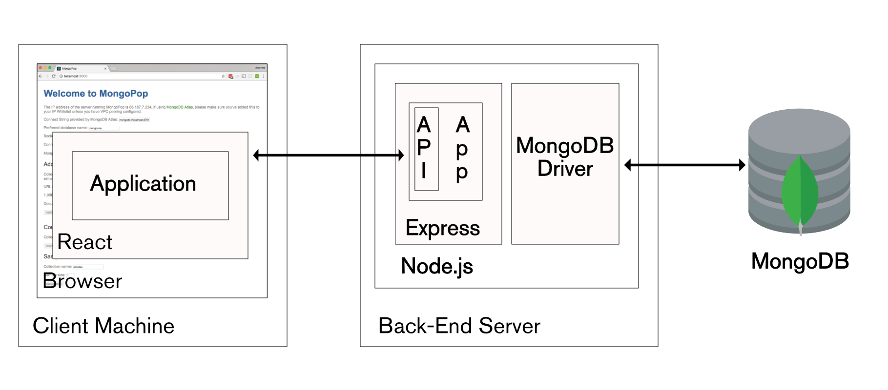

# Wild Play Project

Here is the project for Web Technologie course at Griffith College

by Thibaut Hervet, Thomas Odin, Xiang Yu Oon, Kirill Smirnov

## Structure

## Backend

For more information : [Backend Readme](backend/README.md)

### Backend url

https://wild-play-api.vercel.app/

### Routes and Endpoints

#### 1. Users

**Base Route:** `/api/users`

- `POST /register` - Register a new user
- `POST /login` - Login user
- `GET /search` - Search users based on username
- `PUT /update/` - Update user profile
- `DELETE /delete` - Delete the logged account
- `GET /profile` - Get user profile
- `POST /logout` - Logout user
- `GET /search/admin` - Search users (admin only)
- `DELETE /delete/:id` - Delete the logged account (admin only)

#### 2. Search

**Base Route:** `/api/search`

- `GET /` - Perform a global search

#### 3. Campers

**Base Route:** `/api/campers`

- `GET /` - Fetch all campers
- `POST /` - Add a new camper (Admin only)
- `DELETE /:id` - Delete a camper (Admin only)

#### 4. Deals

**Base Route:** `/api/deals`

- `GET /` - Fetch all deals
- `POST /` - Add a new deal (Admin only)
- `DELETE /:id` - Delete a deal (Admin only)

#### 5. Bookings

**Base Route:** `/api/bookings`

- `GET /all/` - Get all bookings for a user
- `GET /:booking_id` - Get a specific booking
- `POST /` - Create a new booking
- `PUT /:booking_id` - Edit an existing booking
- `PATCH /:booking_id/status` - Change booking status
- `DELETE /:booking_id` - Delete a booking

#### 6. Trips

**Base Route:** `/api/trips`

- `GET /` - Get all user trips
- `GET /:id` - Get trip details
- `POST /` - Create a new trip
- `PUT /:id` - Update a trip
- `DELETE /:id` - Delete a trip
- `POST /fromGuide` - Create a trip from a guide

#### 7. Guides

**Base Route:** `/api/guides`

- `GET /` - Get all guides
- `GET /:id` - Get a guide by ID
- `POST /` - Create a new guide
- `PUT /:id` - Update a guide
- `DELETE /:id` - Delete a guide
- `POST /fromTrip` - Create a guide from a trip

#### 8. Reviews

**Base Route:** `/api/reviews`

- `POST /api/reviews/van` - Add a review for a van
- `GET /api/reviews/van/:van_id` - Get reviews for a specific van
- `POST /api/reviews/guide` - Add a review for a guide
- `GET /api/reviews/guide/:guide_id` - Get reviews for a specific guide

#### 9. Help

**Base Route:** /help

- `GET /help` - Access API documentation and guidance

### Authentication & Authorization

- Most routes require authentication (`authenticateUser` middleware).
- Some routes require admin privileges (`isAdmin` middleware).

## Setup

1. Clone the repository
2. Install dependencies: `npm install`
3. Create a `.env` file and set required environment variables based on the example.
4. Start the server: `npm start`

## License

MIT License
